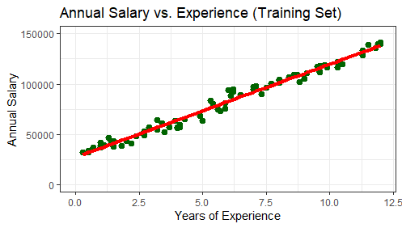

# Predicting Salaries with Simple Linear Regression
### (A Coursera Project)

Here we find linear relationship between year of experiecne and Annual Salary and build a simple linear regression model.

**A beginer level Exercise**

